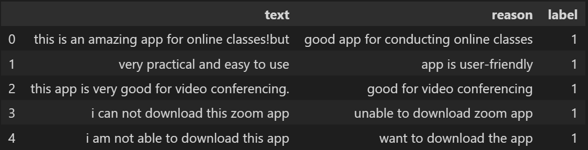
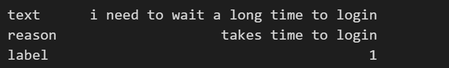

# Semantic-Classification-with-Negative-Data-Generation

### Data Insights:
-	The data consisted of pairs of strings (text and reason) and a label for each pair, with 1 meaning that the reason for the text is correct, and 0 meaning otherwise. Few samples are shown below. It was observed that only pairs with label 1 were present in the dataset.
-	
 
-	The number of samples in the dataset were 2061, which did not seem sufficient for training a Natural Language Inference Model for predicting the text-reason correctness. The strings in both text and reason columns were not grammatically intact in most cases. For example:
-	
 
-	Here, as it can be seen, both text and reason are not properly formed sentences, but rather more informal phrases in nature. 
-	The distribution of length of strings in text is shown by the following histogram:
-	

 
-	The mean length of a string in text is 59, and the plot seems to be skewed towards the left. The maximum length of a string in the text column is 310, while the minimum length is 13.
-	The distribution of length of strings in reason is shown by the following histogram:
-	

 
-	The mean length of a string in reason is 30, and the plot for this is also skewed leftward, although not as much as that for text. The maximum length of a string in the text column is 83, while the minimum length is 11.
-	Therefore, we can observe that, in majority of cases, text is longer than reason.
-	In some cases, the reason could be longer than the text i.e. it is not a sub-part of the text, it is a new sentence which is either an explanation or precise version of the text or sentiment of the text. Either way, the reason will be highly similar to the text. So we can use some kind of similarity matching approach as the baseline.
Baseline Approach:
-	As previously mentioned, I used transformer based similarity matching as a baseline. I took these two steps in all the baseline models:
    - Use a sentence transformer model to convert the given sentences into embeddings.
    - Use cosine similarity with a threshold to determine whether the reason is the correct explanation for the text.
	Sentence Transformer : “multi-qa-mpnet-base-dot-v1” :

 
	Sentence Transformer : “multi-qa-mpnet-base-dot-v1” :

	Sentence Transformer: “all-mpnet-base-v2”:

Training Approach:
-	Artificial Generation of Negative Examples:
o	First thing to note should be that for for a text, there can be only very little amount of correct reasons and a lot of (innumerable) number of incorrect reasons. That is why, I needed to generate more negative samples(0s) than there were positive samples(1s).
o	I used two techniques in parallel:
	Mask-Filling
	Paraphrasing
o	Generation of Mask:
	Masking Adjectives and Verbs (because the intent of the sentence largely on these two parts of speeches.
	Masking Random Words
o	Model used for part-of-speech tagging: “flair/pos-english”
o	Then, I first tried to mask the adjectives and the verbs, and only in cases, where these two weren’t there which led to no masking, I used random masking.
o	Mask-filling model used : “distilbert-base-uncased” and “albert-base-v2”
o	Paraphrasing model used: “eugenesiow/bart-paraphrase”
o	Now, using these two techniques, I generated two negative samples for each positive sample, which led to a total of 6183 training samples.
-	Training the Classification model:
o	Model Used: BertForSequenceClassification.from_pretrained("textattack/bert-base-uncased-yelp-polarity")
o	Optimizer: AdamW ; Learning Rate: 2e-5
o	Learning Rate Scheduler : “Linear”
o	Number of Epochs : 20
o	Used GPU with Accelerator for fast training
o	With training only on the given, the given data, the results of this model weren’t very good. The main reason for this I think, was the lack of training examples.
o	2nd Model Used: ynie/roberta-large-snli_mnli_fever_anli_R1_R2_R3-nli
o	I used this pretrained roberta model on the SNLI Dataset and finetuned it on the given dataset.

  
o	Clearly, The Roberta Model Outperforms all the other models in all the metrics.
